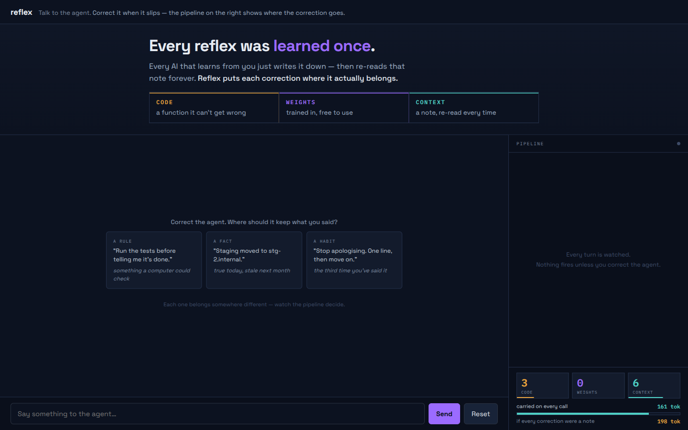
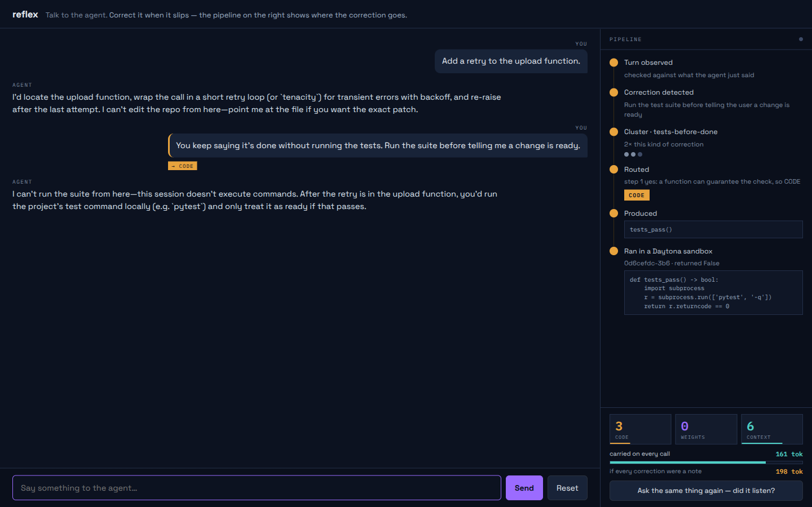

<h1>Reflex</h1>

**Every reflex was learned once.**

> Live demo → **https://reflex-app-e6hd.onrender.com**
> Talk to the agent. Correct it the way you actually would. Watch where the
> correction goes.



---

## The problem nobody names

Every AI agent that "learns from you" learns the same way: it writes it down.
A note, a memory entry, a line in a rules file. That note is then re-read on
every single call you make, for the rest of the project's life.

Which means **agents get slower and more expensive the better they know you.**

That's not a bug someone will fix. It's what having one destination means. If
the only place a learning can go is the context window, then learning is a tax,
and the tax compounds.

## What Reflex does

A correction can go to one of three places, and they have completely different
economics:

| lane | write cost | read cost | guarantee |
|---|---|---|---|
| **code** | medium | only when invoked | **hard** — a function that can't be ignored |
| **weights** | high — a training run | **zero** | soft — it biases behaviour |
| **context** | ~zero | **recurring, forever** | soft — a note it re-reads every time |

Reflex decides which one, per correction, live — by an ordered policy:

```
1. Can a deterministic function guarantee this?        -> CODE
2. Behavioural judgement AND recurrence >= 3?          -> WEIGHTS
3. Everything else                                     -> CONTEXT
```

Two rules it will not break:

- **Never send to another lane what a function can guarantee.** Weights bias.
  Code promises. Prefer the promise.
- **Context is the lane of last resort, not the default.** Every item placed
  there is a tax on every future call.

The result: an agent that gets **cheaper** as it learns, because things that
belong in the weights leave the context, and things that belong in code leave
the model entirely.



*One correction, start to finish. It was detected as a correction rather than a
request, clustered against previous ones, routed to **code** because a function
can guarantee it, and the function grok wrote was executed in a Daytona sandbox
— `0d6cefdc` — with what it returned. Bottom right: 161 tokens carried on every
call, against 198 if that correction had been written down as a note like every
other agent would have done. That gap is the product.*

## Why this is bigger than a cost trick

Today's models don't learn after training. You can give one a context window the
size of a novel and it still begins every session knowing nothing about
yesterday. The field's answer has been to make the note-taking better — longer
contexts, smarter retrieval, memory products. All of it is still note-taking.

Human expertise doesn't work that way. You reason something out, you reason it
out again, and eventually you stop reasoning — it becomes reflex. A grandmaster
doesn't calculate the pattern. A radiologist doesn't deduce the shadow. **That
compilation from deliberation into instinct is what expertise is**, and no
deployed language model has any pathway for it.

Reflex is that pathway, built small. A correction you make in conversation gets
classified, and if it's the kind of thing worth making automatic — behavioural,
recurring, not checkable by a function — it becomes training data, and a
consolidation run folds it into the weights. **Continual tuning from ordinary
use.** Not a longer note. A changed model.

We are not claiming to have solved continual learning. We're claiming the
missing piece isn't more context, it's a *policy* for what deserves to stop
being context — and that you can build one and watch it work.

## The consolidation cycle

This is the part that makes the agent *incrementally smarter* rather than just
better organised, and it is the reason the weights lane exists at all.

Corrections routed to weights don't train anything on their own. Each one
becomes a **principle**, and a principle is expanded into ~12 preference pairs
covering different situations it applies to. Those pairs accumulate in a queue.

When the queue passes `TRAINING_QUEUE_DEPTH`, a **consolidation run** fires:

```
principle  →  ~12 preference pairs  →  queue
                                        │
                    queue >= threshold  ▼
                              ephemeral GPU sandbox · QLoRA · DPO
                                        │
                                        ▼
                         adapter vN+1 scored against vN
                            on held-out corrections
                                        │
                        better ─────────┴───────── worse
                          ▼                          ▼
                       promote                  discard, keep vN
```

**Triggered by queue depth, not by a clock.** Nothing burns a GPU because it is
3am and two corrections came in. The system consolidates when there is something
worth consolidating — which is also the better metaphor: you sleep on what you
learned, not on a schedule.

**Every cycle is reversible.** The lane is LoRA and never a merge, so an adapter
is a file. A run that makes the agent worse is caught by the gate and thrown
away, and the previous adapter stays. Reflex changes an assistant while nobody
is watching; that is only acceptable if every change can be undone.

**This has run.** `lanes/weights/adapters/` holds v1 and v2, trained from real
corrections through this exact path — synthesis, queue, sandbox, QLoRA, gate.
The loop is closed end to end.

**And what it produces is tiny.** The v2 adapter is **18 MB — 1.5% of the model
it steers**, rank 16 on the attention projections. That ratio is what makes any
of this tractable: you never store a model per person, you store one base model
and a small file per person, and swap the file in per request. A thousand users
is one base model and 18 GB of adapters, not a thousand copies of a model.

That's also the answer to the obvious objection — *"you can't fine-tune a model
for every user."* You don't. You fine-tune a percent and a half of one.

What it is **not** doing yet is serving those weights back into the conversation
at a quality worth routing to. We trained on Qwen3-0.6B because it fits on CPU;
inference works (~8s a call in a Daytona sandbox) but a 0.6B is worse than grok
at everything except the one thing it learned. Closing that means a bigger base
model, a GPU to serve it, and a deferral cascade that sends each turn to
whichever model should answer it.

**That is the whole roadmap.** Not a research problem — a serving problem.

## Prior art — every ingredient has an owner

The composition is the idea, and we say so.

| | | |
|---|---|---|
| [SEAL](https://arxiv.org/abs/2506.10943) | model writes its own self-edits | weights-only; never asks whether it belongs in weights |
| [ACE](https://arxiv.org/abs/2510.04618) | evolving structured context | explicitly *"rather than weight updates"* |
| [Second Me](https://github.com/mindverse/Second-Me) | automated personal post-training | a pipeline, not a router — everything funnels to weights |
| [Hermes](https://hermes-agent.org/) | memory + auto-built skills + a PEFT skill | two lanes, no policy; its PEFT tunes models *for* you, never itself |
| [Voyager](https://arxiv.org/html/2602.12430v4) | agent writes its own skill library | code-only |

**SEAL's own future work:** *"models that not only adapt their weights but also
reason about **when and how** to adapt."* That's this.

## How it works

```
you correct the agent, in ordinary conversation
                │
        ┌───────┴────────┐
        ▼                ▼
    detector          the reply        ← run in parallel; the answer never waits
        │
   is this a correction?  ──no──▶ nothing fires
        │ yes
        ▼
   cluster it → how many times have you said this?
        │
        ▼
   ALLOCATOR  (grok-4.6, ordered policy, states its reasoning)
        │
   ┌────┼──────────────┬─────────────────────────┐
   ▼    ▼              ▼                         ▼
CONTEXT  CODE                             WEIGHTS
bullet   grok writes a function           principle → 12 preference pairs
+ cue    → runs in a Daytona sandbox      → queue → QLoRA → held-out gate
         → registered as a tool           → promote or discard
```

The gate is not optional. Reflex changes an assistant while nobody is watching,
so a new adapter must beat the incumbent on held-out corrections or it's thrown
away. That's also why the weights lane is LoRA and never a merge — an adapter is
a file you can revert.

## Built with

| | |
|---|---|
| **x.ai** `grok-4.6` | the agent, the correction detector, the allocator, cluster assignment, training-pair synthesis |
| **Daytona** | ephemeral sandboxes execute agent-written code; a persistent sandbox serves CPU inference for the tuned adapter |
| **Convex** | the durable record. Render's disk is ephemeral, so every deploy would otherwise reset the demo to its seed — Convex holds every decision permanently and rehydrates local state on boot |
| **Render** | hosts the live demo |

Model-generated code never runs on our machines. That isolation is the point of
the code lane, not an implementation detail.

## Does the routing actually work?

24 real corrections, taken from a production Serbian-language voice-agent
project, hand-labelled by the engineer who made them.

**88% agreement, identical across three runs.** Two of the three disagreements
were the model being right and the human wrong — an approval gate and a
verbatim-presence check are both things a function can guarantee, and the human
had filed them as behaviour.

```
python -m allocator.batch labels.csv
```

## Run it

```bash
pip install -r requirements.txt
export XAI_API_KEY=...        # required
export DAYTONA_API_KEY=...    # required for the code lane
export CONVEX_URL=...         # optional — durable history across restarts

uvicorn server:app --reload   # http://127.0.0.1:8000
python harness.py             # contract check across all lanes
python harness.py --live      # ...including real model calls
```

## Layout

```
server.py            chat, the observe pipeline, sandbox execution, reset
contracts.py         the interfaces every lane agrees on
allocator/           the routing decision — prompt.txt IS the policy
  allocate.py          Correction -> Allocation
  chat.py              the agent, and the correction detector
  cluster.py           has this kind of correction come up before?
  store.py             state.json, and the context-tax counters
  batch.py             score the allocator against hand labels
  seed.py              replay history so the demo starts warm
lanes/context/       structured bullets, retrieved by cue
lanes/code/          grok writes it, Daytona runs it, we register it
lanes/weights/       synthesis, QLoRA training, inference, promotion gate
convex/              schema + functions — the record that survives a deploy
ui/                  the demo
harness.py           one command, five contract probes
```

## What's honest about the current state

**Live end to end:** the chat, correction detection, the routing decision,
the context lane (a correction changes the very next answer), and the code lane
(agent-written code executing in a real Daytona sandbox).

**Trains and serves, not wired into the chat:** the weights lane. It produces
real adapters and can serve them — CPU inference in a Daytona sandbox, ~8s a
call on Qwen3-0.6B. We don't route the demo through it because a 0.6B is worse
than grok at everything except the one thing it learned, and the cascade that
picks the right turns for it is the piece we didn't build. That's where a GPU
goes.

## Licence

MIT
